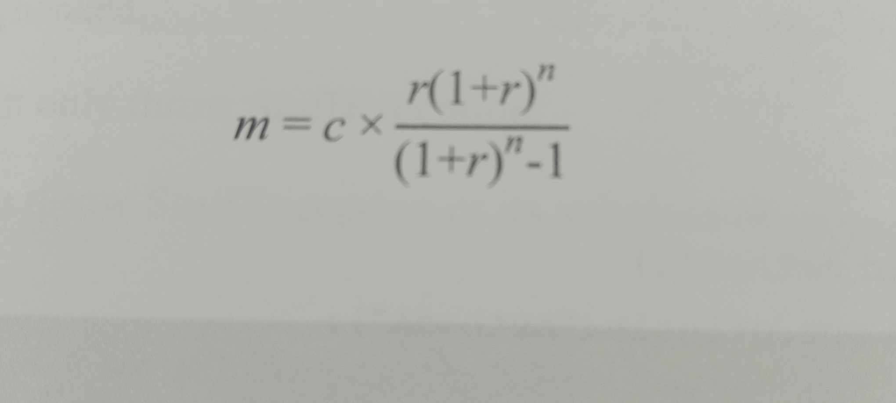

## Q11

give a mathematical formula:



and these declarations:

``` java
  double m;
  double r = 0.1/12;
  int c = 100_000;
  int n = 90;
 
```
how can you code the formula?
``` java
A m=c*(r*Math.pow(1+r,n)/(Math.pow(1+r,n)-1));

B m=c*((r*Math.pow(1+r,n)/(Math.pow(1+r,n))-1));

C m= c*r*Math.pow(1+r,n)/Math.pow(1+r,n)-1;

D m= c*(r*Math.pow(1+r,n)/Math.pow(1+r,n)-1);


```
---

### 解答

**↓↓↓** 

<div style="background-color: black; color: black;" onmouseover="this.style.color='white'" onmouseout="this.style.color='black'">
  Ans : A 

  公式的分母必須要有括號() 確保完整執行 因此選a
</div>

**↑↑↑**

---

### Q12

which is the correct order of possible staements in the sturuture of a java class file?

A class,package,import

B package,import,class

C import,package,class

D package,class,import

E import,class,package

---

### 解答

**↓↓↓** 

<div style="background-color: black; color: black;" onmouseover="this.style.color='white'" onmouseout="this.style.color='black'">
  Ans:b
  通常都是先寫自己是哪一個package 要import甚麼東西

  最後才會進入class的區塊

</div>

**↑↑↑**

---

### Q13

given:

``` java

  public interface ExampleInterface{
  //option A
    public abstract void methodA();
  //option B
    final void methodB(){
      System.out.println("B");
    }
  //option C
    private abstract void methodC();
  //option D
    public String methodD();
  //option E
    public  int e;
  //option F
    final void methodF();
  // option G
     public void methodG(){
      System.out.println("G");
     }
  }
```

which two options are vaild to be written in this interface?(Choose two)

A OptionA

B OptionB

C OptionC

D OptionD

E OptionE

F OptionF

G OptionG

---

### 解答

**↓↓↓** 

<div style="background-color: black; color: black;" onmouseover="this.style.color='white'" onmouseout="this.style.color='black'">
  Ans:AD
  
  B 介面方法必須覆寫 因此不能設為 final

  C 抽象方法必須繼承 不能設為private(無法改寫 自相矛盾)

  E 在介面的欄位必須要 public static final 且必須賦值 否則抱錯

  F 不能有final 方法

  G 在介面不能直接實現方法 要提供空位給人覆寫 (Static 方法可以實作)


</div>

**↑↑↑**

---

### Q14

given:

``` java
    public class Test{
      public  static void main(String[] params){
         for(int x=0;x<params.length;x++){
           System.out.print(x+")." +params[x]);
           switch (params[x]) {

             case :"one":

              continue;

             case :"two":

                x--;

               continue;

             default:

               break;
           }
         }
      }
    }
```
executed with this command:

java Test one two three

What was the result?

A 0).one

B 0).one1).two2).three

C the compilation fails

D it creates an infinite loop printing:0).one1).two1).two...

E java.lang.NullpointerException is thrown

---

### 解答

**↓↓↓** 

<div style="background-color: black; color: black;" onmouseover="this.style.color='white'" onmouseout="this.style.color='black'">

  Ans:D
  
  從最開始輸入 String 陣列 one two three

  x=0 時 0.)one

  x=1 時 1.)two 遇到x-- x=0

  陷入無限print 1.)two 的情況

</div>

**↑↑↑**

---


### Q15

given:

``` java 
   public interface Builder{
     public X build(String s);
   }
   class BulderImpl implements Builder{
      @Override
      public Y build(String s){
        return new Y();
      }
   }
```
Assuming this code compiles correctly which 3 statements are true?

A Y cannot be abstract

B Y is a subtype of x

C X cannot be abstract

D X cannot be final

E Y cannot be final

F X is a subtype of Y.

---

### 解答

**↓↓↓** 

<div style="background-color: black; color: black;" onmouseover="this.style.color='white'" onmouseout="this.style.color='black'">

  Ans: ABD
  
  複寫回傳型別一定更小所以 Y一定X的子類別

  x類別有子類別不可能為final

  因Y 可以建立實例物件因此他不可能是抽象類別

  final 定義

  final class 類別無法被繼承

  final method 方法無法被複寫

  final field 變數欄位無法修改

  (final 建構子自相矛盾不成立)

</div>

**↑↑↑**

---

### Q16

given:

``` java
    public  class SportsCar extends Vehicle{
      private float turbo;
      //...
      public void setTurbo(float turbo){
         this.turbo = turbo;
      }
    }
```

what is known about the SportsCar class ?

A the SportsCar class is a subclass of vechicle and inherits its methods

B the Sprotcar class is a subclass and cannot override settubo method from the superclass Vehicle

C the SportCar class is a superclass that has more funtionality that the Vehicle class.

D the SportCar class inherits the setTurbo method fron the superclass Vehicle

---

### 解答

**↓↓↓** 

<div style="background-color: black; color: black;" onmouseover="this.style.color='white'" onmouseout="this.style.color='black'">

  Ans: A
  
  extends 可以繼承除了父類的屬性和方法

  b setturbo 是 SportsCar 自己定義的,談不上覆寫

  C sportcar 是子類別

  D setturbo 是 SportsCar 自己定義的

</div>

**↑↑↑**

---

### Q17

given

``` java

  package a;
  public class Lab{
     String name;

     public Lab(String name){
       this.name = name;
     }

     public String toString(){
          return name;
     }
  }

```

AND

``` java

    package b;
    import a.Lab;
    public class Test{
      public static void main(String[] args){
        Lab t = new Lab("students");
        System.out.println(t);
      }
    }
```
what is the result?

A null

B nothing

C it fail to compile

D java.lang,IllgelAccessException is thrown

E student

---

### 解答

**↓↓↓** 

<div style="background-color: black; color: black;" onmouseover="this.style.color='white'" onmouseout="this.style.color='black'">

  Ans: E
  
  可以讀取成功藉由 public 的 toString方法 可以取得protect權限的 物件欄位

</div>

**↑↑↑**
---

### Q18

given

``` java

  public static void main(String[] args) {
    String s = "";
    if(Double.parseDouble("10.00f")>10){
       s+=1;
    }
    if(1_5 == Integer.parseInt("15")){
       s+=2;
    }
    if(2024>2023L){
      s+=3;
    }
    System.out.println(s);
  }
```

what was the result?

A 23

B 12

C 123

D 13

---

### 解答

**↓↓↓** 

<div style="background-color: black; color: black;" onmouseover="this.style.color='white'" onmouseout="this.style.color='black'">

  Ans: A
  
  Double的10等於10

  1_5可以用來分隔數字等同於15

  2024>2023L(Long單位型態)

  字串加數字會自動變成串聯字符串

</div>

**↑↑↑**
---

### Q19

given:

``` java

   class Foo{
     public void foo(Collection c){
       System.out.println("Bonjour le monde");
     }
   }

   class Bar extends Foo{
        public void foo(Collection c){
          System.out.println("Hello world");
        }
   

       public void foo (ArrayList a){
          System.out.println("ola Mundo");
       }
    }
```

And

``` java

   public static void main(String[] args) {
     Foo f1 = new Foo();
     Foo f2 = new Bar();
     Bar b1 = new Bar();
     Collection<String> c = new ArrayList<>();
     //line 1
   }
```
which three in line 1 are true?

A b1.foo(c) outputs Bonjour le monde

B f1.foo(c) outputs Hello world

C f1.foo(c) outputs ola Mundo

D b1.foo(c) outputs Hello world

E f2.foo(c) outputs Ola Mundo

F b1.foo(c) outputs Ola Mundo

G f2.foo(c) outputs Bonjour le monde

H f2.foo(c) outputs Hello world

I f1.foo(c) outputs Bonjour le monde

---

### 解答

**↓↓↓** 

<div style="background-color: black; color: black;" onmouseover="this.style.color='white'" onmouseout="this.style.color='black'">

  Ans: DHI
  
  開頭(參考型別) 尾(實際型別)
  以 Foo Foo 只有父類 所以會走 Bonjour le monde

  以 Foo bar 實際型別為bar 因此會呼叫 bar內的覆寫方法

  以 foo Bar 因此會呼叫 bar內的覆寫方法

  override要求覆寫傳入行型別一定一樣 只有回傳的可以是子類或本來

  因此 ArrayList 的foo其實是多載 可以傳ArrayList的型態才會觸發

</div>

**↑↑↑**
---

### Q20

given

``` java
    
    public class Person{
      private String name = "Duke";
      public Person(String name){
        this.name = name;
      }
      public String toString(){
        return name;
      }
    }
    public static void main(String[] args) {
      Person p1 = new Person(); //line 1
      System.out.println(p1);
    }
````

What is the result

A null

B duke

C the compilation fails due to an error in line one

D p1

---

### 解答

**↓↓↓** 

<div style="background-color: black; color: black;" onmouseover="this.style.color='white'" onmouseout="this.style.color='black'">

  Ans: C
  
  有建構建構子的情況下 預設的空建構子會消失 

  所以如果又創了一個空的物件會報錯

</div>

**↑↑↑**

---
