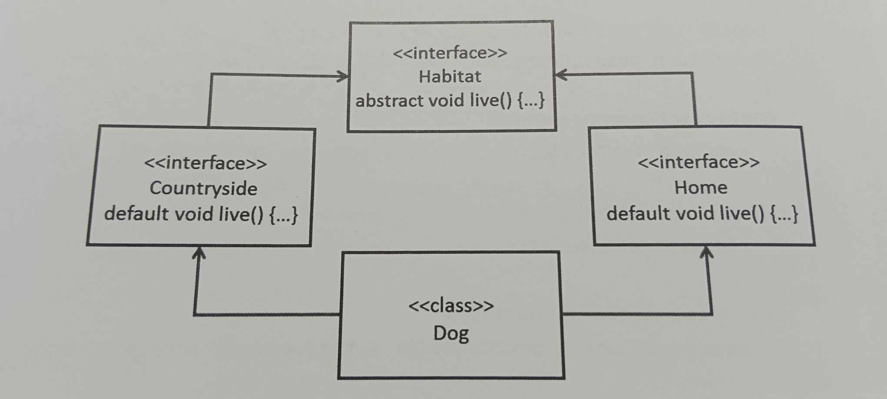

### Q21

given:

``` java
public class Test{
    int acount;
    int tcount;
    int ccount;
    int gcount;

    public int getAcount(int acount){
    	return acount;
    }

    public int getTcount(int tcount){
    	return this.tcount;
    }

    public int getCcount(){
    	return getTotalCount() - this.acount - getTcount(0) - gcount;
    }

    public int getGcount(){
    	return getGcount();
    }

    public int getTotalCount(){
    	return acount + getTcount(0) + this.ccount + this.gcount;
    }
}
```

which two methods facilitate vaild ways to read instance fields?(choose two)

## 中翻

哪兩種方法能有效的讀取實例變數(intance fields)

A getTcount

B getAcount

C getTotalCount

D getCCount

E getGCount

---

### 解答

**↓↓↓** 

<div style="background-color: black; color: black;" onmouseover="this.style.color='white'" onmouseout="this.style.color='black'">
  Ans : CD

  A 可以使用但是傳入無關的參數比較沒有效率

  B 無法取得實例參數 只會回傳傳入的參數

  E 沒意義

  CD 在實例參數中 沒用this指定的話且沒有區域參數遮蔽(其有優先權)的情況下

  會自動視其為this.實例參數 可以修改

</div>

**↑↑↑**

---

### Q22



which statement is ture about the dog class?

A dog class does not have to override the live() method,so long as it does not try to call it.

B dog class does not have to override the live() method if countryside and home provide compatible implementations

C dog class must implements either countryside or home interfaces but not both.

D the live() method implementation from the first interface that dog implements will take precedence

E dog class must provide implementation for the live() method

---

### 解答

**↓↓↓** 

<div style="background-color: black; color: black;" onmouseover="this.style.color='white'" onmouseout="this.style.color='black'">
  Ans : E
  都繼承default 如果不修正 java會不知道要選哪個而導致編譯失敗

  因此會強制dog override他 提供自己的獨特方法遮樣就部會 選擇障礙
  
</div>

**↑↑↑**

---

### Q23

given:

``` java

     class Foo{
     	public void foo(Collection arg){
     		System.out.print("Bonjour le monde");

     	}


     }
     class Bar extends Foo {
     	public void foo(Collection arg){
           System.out.print("Hello world");
     	}
     	public void foo(List arg){
     		System.out.print("hola Mundo");
     	}
     }

```
And:

```  java
   public static void main(String[] args) {
   	 Foo f1 = new Foo();
   	 Foo f2 = new Bar();
   	 Bar b1 = new Bar();
   	 List<String> l = new ArrayList<>();
   	 //line 1 
   }
```
which three in line 1 is true?

A b1.foo(1) outputs hello world

B f1.foo(l) outputs Bonjour le monde

C f1.foo(l) outputs hello world

D f1.foo(l) outputs Hola Mundo

E b1.foo(1) outputs Bonjour le monde

F f2.foo(l) outputs Hola Mundo

G f2.foo(l) outputs Bonjour le monde

H b1.foo(1) outputs Hola Mundo

I f2.foo(l) outputs hello world

---

### 解答

**↓↓↓** 

<div style="background-color: black; color: black;" onmouseover="this.style.color='white'" onmouseout="this.style.color='black'">
  Ans : BHI
  編譯器會先看預期型別 如 實際型別是子類別 且有覆寫的話 則優先執行

  方法參數也是 優先選擇子類別 決定執行的方法

  而 方法重載是根據「編譯時型別」選擇

  總結: 覆寫是以實際型別 重載是以宣告型別決定

  兩邊同時都以最新改寫的方法為行動的方法
  
</div>

**↑↑↑**

---

### Q24

given:

``` java

   abstract class Vehicle{ //line 1
   	   abstract voio wheels();
   }
   class Car extends Vehicle {
                                  //line 2
   	   void wheels(int i){      //line 3
   	   	  System.out.println(5);
   	   }
   }
```
and

``` java

   public class Test{

   	 public static void main(String[] args) {
   	 	 Vehicle ob = new Car(); //line 4
   	 	 ob.wheels();
   	 }
   }
```

what must you do so that the code prints 5?

A remove the paramter form wheels method in line 3

B Add @override annotation in line 2

C replace the code in line 4 with Car ob= new Car();

D remove abstract keyword in line 1

---

### 解答

**↓↓↓** 

<div style="background-color: black; color: black;" onmouseover="this.style.color='white'" onmouseout="this.style.color='black'">
  Ans : A

   移除行3的參數設置 遮樣呼叫就可以 直接叫到wheel方法
  
</div>

**↑↑↑**

---

### Q25

given:src/b/Refer.java

``` java
    
    package b;
    public class Refer{

    }
```
And:src/a/Test.java

``` java

    package a;
    import b.Refer;
    public class Test{
    	public static void main(String[] args) {
    		Refer b = new Refer();
    	}
    }
```
which is the vaild way to generate bytecode for all classes?

A java /src/a/Test.java

B javac d/src /src/a/test

C java /src/a/Test.java /src/b/Refer.java

D java cp /src a.Test

E javac d /src /src/a/Test.java /src/b/Refer.java

---

### 解答

**↓↓↓** 

<div style="background-color: black; color: black;" onmouseover="this.style.color='white'" onmouseout="this.style.color='black'">
  Ans : E

   javac 編譯class執行黨
   -d d 指定檔案的存放路徑 
  
</div>

**↑↑↑**

---

### Q26

given:

``` java
   public class Employee{
   	   private String name;
   	   public Employee(String name){
   	   	 this.name = name;
   	   }
   	   public String toString(){
   	   	   return name;
   	   }
   }
```

And

``` java
   
   public class Test {
   	   public static void main(String[] args) {
   	   	   Employee p = null;
   	   	   checkEmployee(p);
   	   	   System.out.print(p);
   	   	   p = new Employee("Mary");
   	   	   checkEmployee(p);
   	   	   System.out.print(p);
   	   }
   }
   public static Employee checkEmployee(Employee p){
   	     if(p==null){
   	     	p = new Employee("joe");
   	     }else{
   	     	p = null;
   	     }
   	     return p;
   }
```
what is the result?

A joeMarry

B joenull

C nullnull

D nullMary

---

### 解答

**↓↓↓** 

<div style="background-color: black; color: black;" onmouseover="this.style.color='white'" onmouseout="this.style.color='black'">
  Ans : D

   java 是 passbyvalue 所以在方法內的參數改動不會影響到外部即使他的名子一樣
   大陷阱題
  
</div>

**↑↑↑**

---

### Q27 

given:

``` java

    class Super{
    	static String greeting(){
    		return "good night";
    	}
    	String name(){
    		return "java";
    	}
    }
    class Sub extends Super{

    	static String greeting(){
    		return "good afternoon";
    	}
    	String name(){
    		return  "duke";
    	}
    }
```
And:

``` java

   public class Test{

   	  public static void main(String[] args) {
   	  	  Super s = new Sub();
   	  	  System.out.print(s.greeting()+ ","+s.name());
   	  }
   }
```
what was the result?

A good Afternoon,duke

B good night,duke

C goodAfternoon,java

D good night,java

---

### 解答

**↓↓↓** 

<div style="background-color: black; color: black;" onmouseover="this.style.color='white'" onmouseout="this.style.color='black'">

    Ans : B

   只有物件方法有覆寫機制 靜態方法沒有 所以會以宣告型別為準
  
</div>

**↑↑↑**

---

### Q28

given:

``` java
   
   public class Main{

   	    public static void sayHello(String... args) {
   	    	System.out.print("Hello ");
   	    	for(String arg : args){
   	    		System.out.println(arg);
   	    	}
   	    }
   	    public static void main(String[] args) {
   	    	Main c = null;
   	    	c.sayHello();
   	    }
   }
```
what is the result?

A NullPointerException is thrown at line 4.

B NullPointerException is thrown at line 10

C A compilation error occurs

D Hello

---

### 解答

**↓↓↓** 

<div style="background-color: black; color: black;" onmouseover="this.style.color='white'" onmouseout="this.style.color='black'">

    Ans : D

   呼叫static方法不需要建構物件 第9行不影響
   行2 可變動個數方法參數 就算是0也不影響

   static以class為主 只要呼叫class相關參數就會被視為呼叫class

   因此c.sayHello();會直接變成Main.sayHello()而不會去訪問c 造成空指針錯誤
  
</div>

**↑↑↑**

---

### Q29

given:

``` java

    public static void main(String[] args) {
    	for(var i=0;i<10;i++){
    		switch (i % 5) {
    			case 2 :
    				i *= i;
    				break;
    			case 3 :
    				i++;
    				break;
    			case 1 :
    			case 4 :
    				i++;
    				continue;
    			default:
    				break;
    		}
    		System.out.print(i+" ");
    		i++;
    	}
    }
```
what was the result?

A nothing

B 0

C 10

D 0 4 9

---

### 解答

**↓↓↓** 

<div style="background-color: black; color: black;" onmouseover="this.style.color='white'" onmouseout="this.style.color='black'">

    Ans : D

   switch中的break是結束本身的區塊 但其contiune會結束整個迴圈
  
</div>

**↑↑↑**

---

### Q30

what makes java dynamic(動態)?

A at runtime,classes are loaded as needed,and new code modules can be laoded on demend

B the runtime can process machine language sourses as well as executables from different language compilers.

C the java compiler uses reflection to test if class methods are supported by resources of a target platform

D the java compiler preprocessess classes to run on specific target platforms

### 中翻

A. 在運行時（runtime），類別會根據需要加載，並且可以按需載入新的程式碼模組。

B. Java 執行時可以處理機器語言來源（machine language sources），以及來自不同語言編譯器的可執行文件（executables）。

C. Java 編譯器使用反射（reflection）來測試類別方法是否受到目標平台資源的支持。

D. Java 編譯器會預處理（preprocess）類別，使其能夠在特定的目標平台上執行。


---

### 解答

**↓↓↓** 

<div style="background-color: black; color: black;" onmouseover="this.style.color='white'" onmouseout="this.style.color='black'">

    Ans : A

   在java可以在執行時根據需求載入類別 可以在執行時提供反射 允許檢查欄位方法 

   甚至可以動態建立物件 也可以在執行時動態載入 class類別

   而不需再重新啟動的情況下 載入新模組

</div>

**↑↑↑**

---


